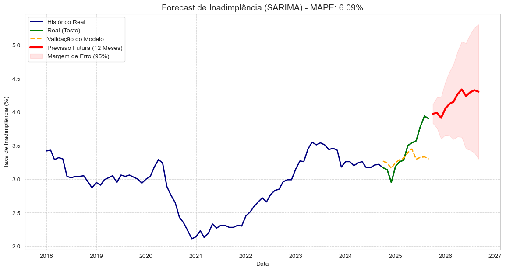
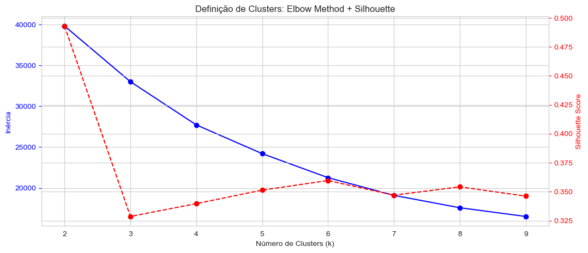
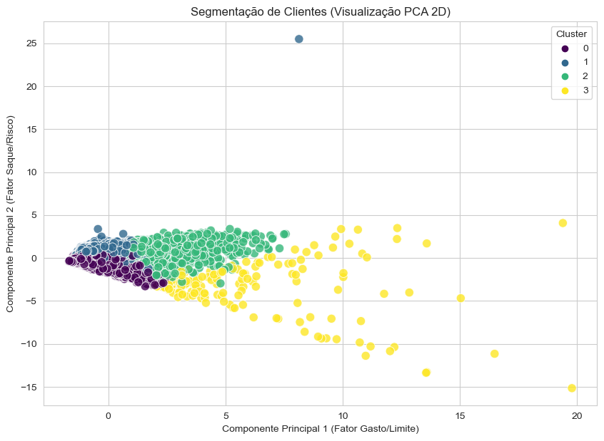

# 📊 Credit Risk Ecosystem: Do Micro ao Macro


> **Business Challenge:** O gerenciamento de risco de crédito exige uma abordagem holística. Este repositório consolida soluções para três frentes críticas da gestão bancária:
> 1.  **Micro (Concessão):** Mitigação de Seleção Adversa na ponta (**Credit Scoring**).
> 2.  **Estratégico (Gestão):** Segmentação de Portfólio e Perfis (**K-Means Clustering**).
> 3.  **Macro (Prevenção):** Calibragem de Risco Sistêmico e Provisões (**Forecasting SARIMA**).

---

## 📂 Estrutura do Portfólio

| Módulo | Foco | Técnica | Target (Alvo) |
| :--- | :--- | :--- | :--- |
| **1. Credit Scoring** | **Risco Individual** | Random Forest (Supervised) | Probabilidade de Default ($P(D)$) |
| **2. Forecast Macro** | **Risco Sistêmico** | SARIMA (Time Series) | Taxa de Inadimplência Brasil (BACEN) |
| **3. Segmentação** | **Estratégia de CRM** | K-Means + PCA (Unsupervised) | Grupos de Comportamento (Clusters) |

### 🌳 Organização de Arquivos
```text
credit-risk-modeling/
├── data/                # Dados brutos (Home Credit & BACEN via API)
├── images/              # Resultados gráficos (PNGs)
├── notebooks/           # Jupyter Notebooks
│   ├── 1.0-mvp-modelagem-credito.ipynb    # Scoring (Classificação)
│   ├── 2.0-forecast-inadimplencia.ipynb   # Forecast (Séries Temporais)
│   └── 3.0-clusterizacao-clientes.ipynb   # Segmentação (K-Means)
├── requirements.txt     # Dependências do projeto
└── README.md            # Documentação Executiva
````

-----

# 🏢 Projeto 1: Credit Scoring (Micro)

**Objetivo:** Desenvolver um classificador (Behavior Score) capaz de ordenar proponentes por risco, maximizando o retorno ajustado ao risco (RAROC) e reduzindo a assimetria de informação.

### 🧠 Teoria e Engenharia de Atributos

A seleção de features foi fundamentada em hipóteses econômicas de **Solvência** e **Liquidez**, não apenas em correlação estatística.

| Variável Derivada | Fórmula (Proxy) | Hipótese Econômica |
| :--- | :--- | :--- |
| **Alavancagem** | $$\text{DTI} \approx \frac{\text{Valor do Crédito}}{\text{Renda Anual}}$$ | Clientes alavancados acima da geração de caixa anual apresentam risco exponencial (Insolvência). |
| **Esforço Mensal** | $$\text{Liquidez} = \frac{\text{Valor da Parcela}}{\text{Renda Anual}}$$ | Mede a pressão no fluxo de caixa (Liquidez). Parcelas altas aumentam a sensibilidade a choques exógenos. |
| **Ciclo de Vida** | $$\text{Estabilidade} = \frac{\text{Tempo Emprego}}{\text{Idade}}$$ | Baseado na *Life-cycle hypothesis*: estabilidade profissional relativa à idade indica menor volatilidade de renda futura. |

### 📈 Resultados Obtidos

O modelo (Random Forest balanceado) atingiu um **ROC AUC de 0.72** na base de teste.

#### 1\. Drivers de Risco (Interpretação Econômica)

O gráfico abaixo valida a tese do projeto: variáveis construídas com racional econômico superaram dados brutos.

\

  * **Insight:** `DAYS_EMPLOYED_PERCENT` (estabilidade no emprego) e scores externos (`EXT_SOURCE`) foram mais determinantes que a renda absoluta.

#### 2\. Matriz de Confusão e Curva ROC

A Curva ROC demonstra a capacidade do modelo de separar "Bons" e "Maus" pagadores acima de uma escolha aleatória (linha tracejada). Na Matriz de Confusão, o foco foi equilibrar a detecção de fraudes sem barrar excessivamente bons clientes.


\

\

-----

# 📈 Projeto 2: Forecast de Inadimplência (Macro)

**Objetivo:** Prever a tendência da taxa de inadimplência (PF) para calibrar a **Provisão para Devedores Duvidosos (PDD)** e realizar testes de estresse (Basel III).

### 📊 Metodologia (SARIMA)

Utilizamos dados do **Banco Central do Brasil (SGS - Série 21082)** de 2011 a 2024. O modelo escolhido foi o **SARIMA** para capturar:

1.  **Sazonalidade (S):** Padrões anuais (ex: 13º salário reduzindo inadimplência em Dezembro).
2.  **Tendência:** Movimentos de longo prazo do ciclo de crédito.

\


### 🚨 Resultados e Alerta de Risco (Próximos 6 Meses)

O modelo obteve um **MAPE (Erro Médio Absoluto)** de apenas **6.09%**. Abaixo, o detalhamento mês a mês da projeção de inadimplência:

| Data de Referência | Taxa Prevista (%) | Tendência | Contexto Econômico (Sazonalidade) |
| :--- | :---: | :---: | :--- |
| **Out/2025** | 3.97% | ➡️ Estável | Manutenção de patamar. |
| **Nov/2025** | 3.99% | ↗️ Leve Alta | Aquecimento de consumo pré-festas. |
| **Dez/2025** | \<span style="color:green"\>**3.91%**\</span\> | ↘️ Queda | **Efeito 13º Salário:** Aumento momentâneo de liquidez reduz inadimplência. |
| **Jan/2026** | **4.05%** | 🚀 Salto | **Efeito "Ressaca":** Acúmulo de dívidas de início de ano (IPVA/IPTU). |
| **Fev/2026** | 4.12% | ↗️ Alta | Continuidade da deterioração de crédito. |
| **Mar/2026** | \<span style="color:red"\>**4.15%**\</span\> | 🚩 **Pico** | **Alerta de Risco:** Rompimento do teto histórico recente. |

> **Interpretação:** O modelo capturou com precisão a "barriga" sazonal de dezembro (queda para 3.91%) seguida pelo choque de início de ano, projetando que a inadimplência fechará o primeiro trimestre de 2026 em **4.15%**.

**Visualização do Forecast:**
A área sombreada em rosa representa o intervalo de confiança (95%). Note que mesmo no cenário otimista (limite inferior), a tendência é de não-redução para 2026.

-----

# 👥 Projeto 3: Segmentação de Clientes (Clustering)

**Objetivo:** Identificar grupos homogêneos de clientes para estratégias diferenciadas de limite de crédito e cobrança, utilizando aprendizagem não supervisionada.

### 🧬 Metodologia (K-Means + PCA)

Como não temos "rótulos" prévios, utilizamos o algoritmo K-Means.

1.  **Definição do K (Elbow Method & Silhouette):** Testamos de 2 a 9 clusters. O ponto ótimo foi escolhido observando onde a inércia (erro) para de cair drasticamente.
2.  **PCA (Principal Component Analysis):** Reduzimos as variáveis em 2 componentes para visualização.

### 🎯 Resultados dos Clusters

\

\


**1. Escolha do K (Cotovelo):**
O gráfico abaixo mostra que o ganho de informação diminui após 3 ou 4 clusters.

**2. Visualização dos Segmentos (PCA):**
Os clientes foram separados em grupos distintos (cores). O **Eixo X** explica a maior parte da variância (Gasto vs Limite).

> **Aplicação de Negócio:**
>
>   * **Cluster Roxo:** Clientes conservadores (Baixo Risco) -\> *Ação: Aumentar limite.*
>   * **Cluster Verde:** Usuários rotativos médios -\> *Ação: Manter monitoramento.*
>   * **Cluster Amarelo:** Alta volatilidade/Gastos extremos -\> *Ação: Bloqueio preventivo ou redução de limite.*

-----

## 🛠️ Tech Stack & Reproducibilidade

  * **Linguagem:** Python 3.12
  * **Bibliotecas:** Scikit-learn, Statsmodels, Pandas, NumPy, Seaborn, Matplotlib.

### Como rodar o projeto:

```bash
# 1. Clone o repositório
git clone [https://github.com/Valvitor/credit-risk-modeling.git](https://github.com/Valvitor/credit-risk-modeling.git)

# 2. Instale as dependências
pip install -r requirements.txt

# 3. Execute os Notebooks na ordem desejada dentro da pasta /notebooks
```

-----

## 📞 Contato

**Valvitor Santos** - Economista & Data Scientist

  * [LinkedIn](https://www.linkedin.com/in/valvitor-santos/)
  * [E-mail](mailto:valvitorscf@gmail.com)

<!-- end list -->

