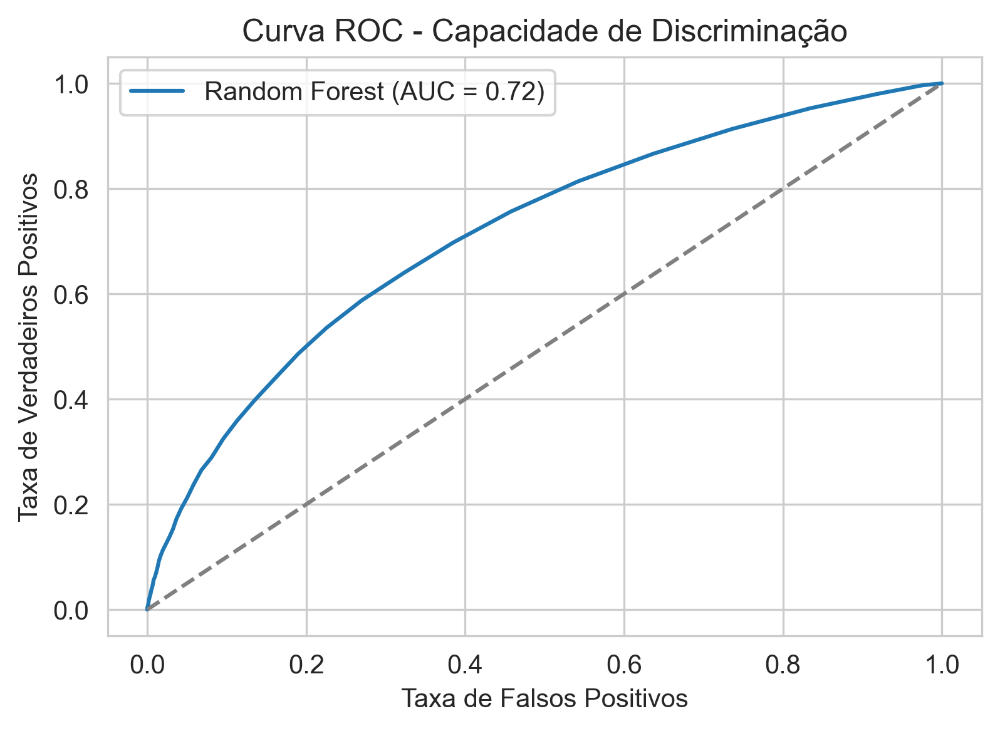
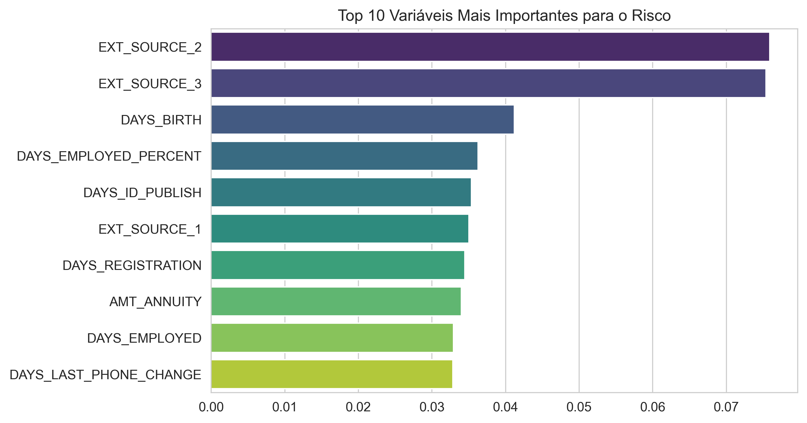

# 💰 Credit Scoring: Modelagem de Risco de Crédito


> **Objetivo:** Desenvolver um algoritmo de Machine Learning capaz de prever a probabilidade de inadimplência (*default*), reduzindo a exposição ao risco e otimizando a concessão de crédito.

---

## 📋 Visão Geral do Negócio
Em instituições financeiras, o maior desafio não é apenas conceder crédito, mas concedê-lo para quem consegue pagar. O problema central é um **problema de classificação desbalanceada**: a maioria dos clientes paga em dia, mas o erro de conceder empréstimo a um mau pagador gera prejuízo direto de capital (Perda do Principal).

Neste projeto, utilizamos dados históricos do **Home Credit** para prever a classe `TARGET` (0: Bom Pagador, 1: Mau Pagador).

### 🎯 KPIs e Métricas de Sucesso
Dada a natureza desbalanceada do dataset, a **Acurácia** é uma métrica enganosa. O foco deste projeto foi maximizar a **ROC AUC (Area Under the Curve)**.
* **Por que AUC?** Ela mede a capacidade do modelo de *ordenar* os clientes. Um bom modelo de risco deve dar uma probabilidade de default mais alta para quem realmente vai atrasar, permitindo à mesa de crédito definir o ponto de corte (threshold) ideal baseada no apetite ao risco da instituição.

---

## 📊 Resultados do Modelo (MVP)

O modelo final, um **Random Forest Classifier** com balanceamento de classes, foi avaliado em 30% dos dados (conjunto de teste).

| Métrica | Resultado | Interpretação |
| :--- | :--- | :--- |
| **ROC AUC** | **0.7151** | Boa capacidade de discriminação entre bons e maus pagadores. |
| **Dataset** | Desbalanceado | Tratado via parâmetro `class_weight='balanced'`. |

### 1. Curva ROC
A curva demonstra que o modelo é superior a uma escolha aleatória (linha pontilhada).


### 2. Importância das Variáveis (Feature Importance)
O que define um cliente de risco? Segundo o modelo, dados externos (Bureau de crédito) e a idade são cruciais.


### 3. Matriz de Confusão


---

## 🧠 Metodologia e Engenharia de Atributos

Como economista, a abordagem não foi apenas "jogar dados no modelo". Houve um processo de construção de hipóteses econômicas transformadas em variáveis (Feature Engineering).

### Variáveis Criadas (Domain Knowledge)
Foram derivadas novas métricas para capturar a saúde financeira real do cliente:

1.  **Comprometimento de Renda (`CREDIT_INCOME_PERCENT`):**
    $$\frac{\text{Valor do Crédito}}{\text{Renda Anual}}$$
    *Hipotése:* Clientes pedindo empréstimos muitas vezes superiores à sua renda anual apresentam maior risco.

2.  **Peso da Parcela (`ANNUITY_INCOME_PERCENT`):**
    $$\frac{\text{Valor da Parcela (Anuidade)}}{\text{Renda Anual}}$$
    *Hipotése:* Quanto maior a parcela em relação ao salário, maior a probabilidade de default.

3.  **Estabilidade Profissional (`DAYS_EMPLOYED_PERCENT`):**
    $$\frac{\text{Dias Empregado}}{\text{Idade do Cliente}}$$
    *Hipotése:* Clientes com maior tempo de emprego relativo à idade tendem a ser mais estáveis.

---

## 🛠️ Tech Stack e Pipeline

O projeto segue um pipeline linear de Data Science:

1.  **Coleta de Dados:** Leitura de arquivos CSV (Pandas).
2.  **Limpeza (Preprocessing):**
    * Remoção de colunas irrelevantes (IDs).
    * Imputação de valores nulos utilizando a **Mediana** (para evitar distorção por outliers de renda).
3.  **Modelagem:**
    * Uso de `RandomForestClassifier`.
    * Configuração `class_weight='balanced'` para penalizar erros na classe minoritária (inadimplentes).
4.  **Avaliação:** Scikit-learn metrics (AUC, Confusion Matrix).

```python
# Exemplo do Core do Modelo
model = RandomForestClassifier(
    n_estimators=100,
    class_weight='balanced', # Tratamento essencial para risco de crédito
    random_state=42,
    n_jobs=-1
)
model.fit(X_train, y_train)
````

-----

## 🚀 Como Reproduzir este Projeto

1.  **Clone o repositório**

    ```bash
    git clone [https://github.com/Valvitor/credit-risk-modeling.git](https://github.com/Valvitor/credit-risk-modeling.git)
    cd credit-risk-modeling
    ```

2.  **Instale as dependências**

    ```bash
    pip install -r requirements.txt
    ```

3.  **Execute o Notebook**

      * Navegue até a pasta `notebooks/`.
      * Certifique-se de que o arquivo `application_train.csv` está na pasta `data/`.
      * Execute todas as células para gerar o treinamento e os gráficos na pasta `outputs/`.

-----

## 📞 Contato

**Valvitor Santos**

  * 💼 [LinkedIn](https://www.google.com/search?q=https://www.linkedin.com/in/valvitor-santos/)
  * 📧 [Email](mailto:valvitorscf@gmail.com)
  * 🐱 [GitHub](https://www.google.com/search?q=https://github.com/Valvitor)

-----

```
```