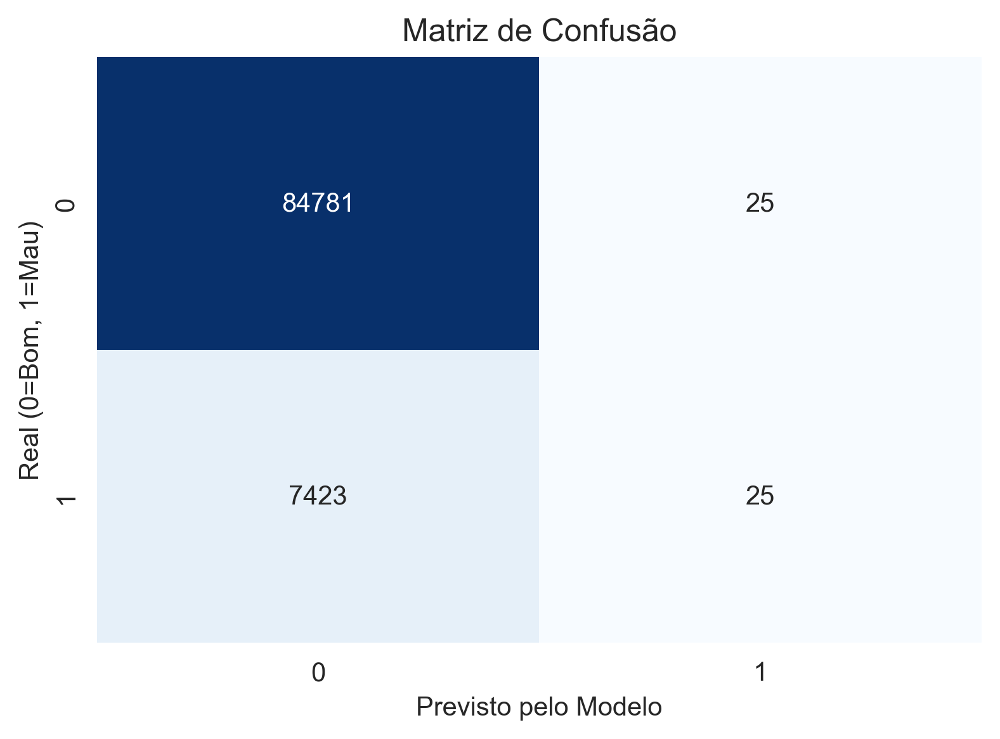

# 💰 Credit Risk Modeling — Classificação de Inadimplência

Este projeto implementa um modelo de **Credit Scoring** para prever a probabilidade de um cliente entrar em *default* (inadimplência) utilizando dados reais do Home Credit Default Risk (Kaggle).

O objetivo é criar uma solução capaz de **reduzir risco de crédito**, permitindo identificar bons pagadores e evitar concessão para clientes com alto risco financeiro.

---

## 📌 Resultados Principais

Após todo o pipeline de preparação, engenharia de atributos e modelagem, o modelo final — Random Forest com balanceamento — atingiu:

**ROC AUC Score: 0.7151**

Isso significa que o modelo possui **boa capacidade de discriminação**, especialmente considerando:

- dataset **altamente desbalanceado**
- variáveis ruidosas e com muitos valores nulos
- ausência de tuning avançado (esta é a versão MVP)

---

## 📊 Métricas e Visualizações

### 📘 Matriz de Confusão


### 📘 Curva ROC


### 📘 Importância das Variáveis


Principais insights:

- **EXT_SOURCE_2** e **EXT_SOURCE_3** são os melhores preditores
- **Idade (DAYS_BIRTH)** é extremamente relevante
- Indicadores de estabilidade profissional têm alto peso

---

## 🛠️ Tecnologias e Ferramentas Utilizadas

- Python 3.12
- Pandas, NumPy
- Scikit-learn
- Matplotlib, Seaborn
- Jupyter Notebook
- VS Code

---

## 🧠 Estratégia da Solução

### ✔️ 1. Pré-processamento
- Remoção de variáveis irrelevantes
- Tratamento de missing values
- Seleção de variáveis numéricas para o MVP

### ✔️ 2. Feature Engineering
Criação de variáveis críticas:
- `CREDIT_INCOME_PERCENT`
- `ANNUITY_INCOME_PERCENT`
- `DAYS_EMPLOYED_PERCENT`

### ✔️ 3. Modelagem
Algoritmo: **Random Forest Classifier**

Com:
```python
class_weight='balanced'
